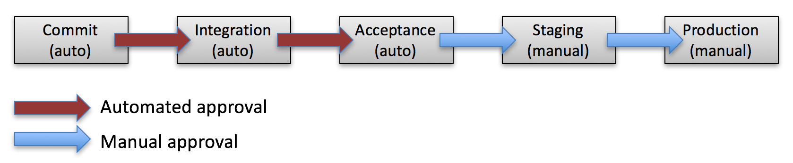

## Content

* The idea behind this course
  * What this course focus on 
  * What we expect you to know
* Common words and definition used in this course
* The examination assignments

Note: Tralla

---
## Why this course?

* Focus on delivering software
* Building deployment pipelines
* Taking stuff to production
* Prepare for thesis?
* Prepare for working with software...with other people
  * There will be some coding...

--
## What we expect you to know

* Testing
  * Unit, acceptance, integration, non-functional
  * Writing and implement
* Working with Git
  * We will focus on more advanced using
* Writing code
* Setting up infrastructure for given software
* Taking responsibility for your own learning

Note: How to write test, when to use them, different kinds and so on.

---
## Some definitions

* Service delivery platform
  * The platform for delivering software eg. deployment pipeline 
  * Validates after every stage in the pipeline (commit, acceptance, staging, production) 
* Service delivery flow 
  * The trip from the beginning to the end
  * Both automatic and manual approvals depending on the step

---
## Some more definitions
* Artifacts 
  * Products produced during the development of software
* Release Candidate
  * The end result of the build phase. May or may not be deployed
* Release
  * Successful completion of an entire flow; including deployment
* Deployment
  * Pushing a release into production
* Gate
  * A limit that prevents the flow. Manual QA for instance
* Staging
  * Environment where integration tests could run

--
## Continuous Integration

* Merge code on commit
  * One code repository
  * Find errors early!
  * No integration debts
* Automated builds
  * fast builds
* Automated testing
  * fast test runs
* Commit every day
  * If a commit fails - fix it directly
* Everyone can see the results of the latest build
  * Transparence

--
## Continuous Delivery

> To have the confidence that the artifact(s) going trough the pipeline will work in production.

--
## Continuous Deployment

> The whole chain from committing a code change to running the change in production is automated

--
## Deployment pipeline

--
## What we aim for

* Confidence
* Reduced risk
* Shorter time from keyboard to production
* Less wait time
  * International timespans
* Continuous Improvement
* Job satisfaction

---
## How we will practice this?

* Individual preparation for the seminar
  * Getting the fundamental knowledge
  * Thinking about a real problem
  * Seminar be like a workshop
* Group project
  * Setting up the pipeline
  * Working as a group of developer through the pipeline
  * Continuous Improvement!

--
## The project

* Service delivery platform for Slack plug-ins for the CoursePress organization
  * Analyze the problem
  * Identifying the parts of the flow
  * Setting up the pipeline
* Develop a plug-in
  * Using your pipeline as a developer
  * Using Continuous Integration in a team
    * Everyone must commit small changes with confidence
    * Plans for handling failing
  * Producing artifacts and infrastructure

