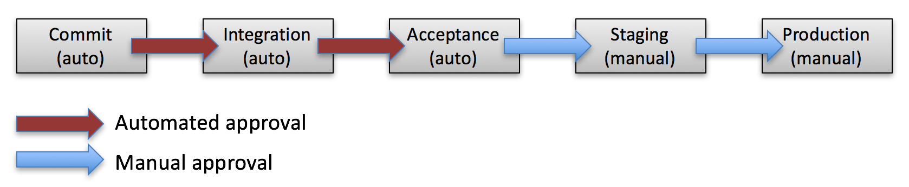
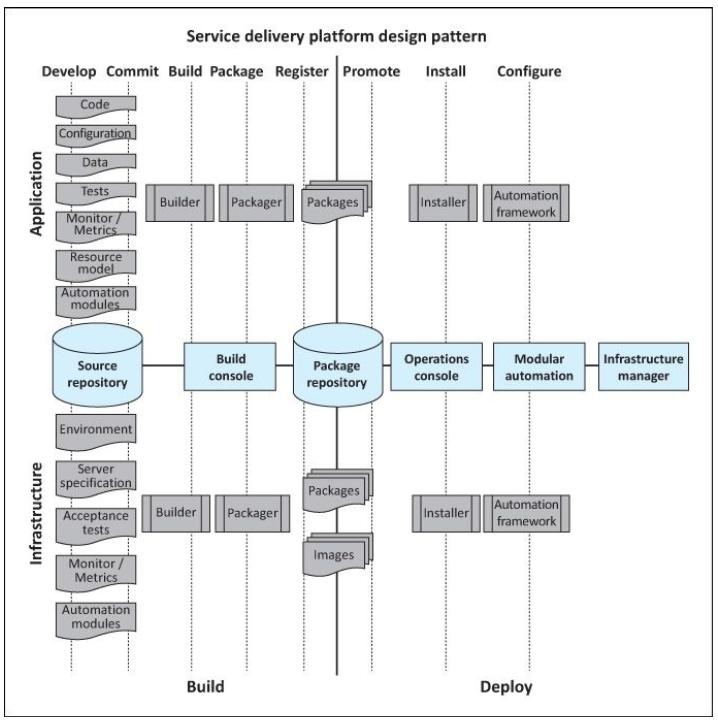
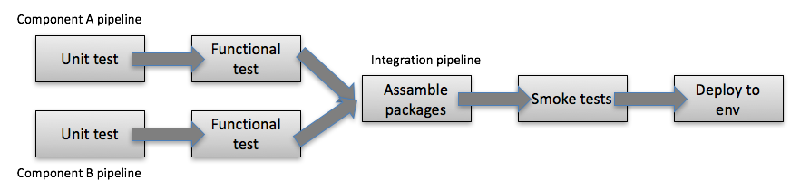
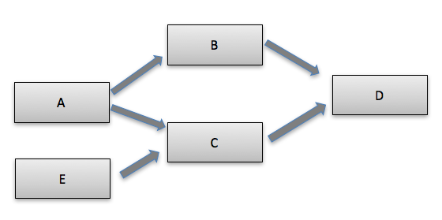

## Content

* Delivering software
  * Anti-pattern
  * Deployment pipeline
    * Build, deploy
* modules/packages


Note: Tralla


---
## Delivering software

* Lots of focus on the development effort
  * Design, development, testing
  * Only a part of the whole "value stream"
* Getting the software from development to release
  * Hard to learn in courses...
  * Many aspects: release management, coordination, security


--
## Traditional development processes


> Serial or waterfall

> Delaying testing until after the development


Note: Release to manufacturing (RTM), going gold
<br>
Testing first in alpha, holding the version longer. how about changes?<br>


--
## Anti-patterns
* Deploying manually
  * Human errors, bottle necks
  * Not reproducible
    * Unpredictable, no confident in the service/code
  * Different environments (dev, test, production)
* Late deployment to production
  * Bugs is found late
  * Gap between dev and ops
  * Devs don´t have ops skills (policies)
  * Incorrect assumptions built into system
* Manual configuration management of production Environments
  * Configuration drifts, snowflake servers and so on

Note: caching in local vs. cluster


--
## What do we want?

* Automated
  * Avoid errors, more confidence
    * Repeatable, reliable, predictable process
  * Self-documented
  * Faster, automate almost everything
* Frequent
  * Smaller changes, fewer roll-backs
  * Fast feedback process
    * code, configuration, host environments, structure of the data
    * Under control so changes trigger a feedback process
* Bring the pain forward
  * if it hurts, do it more frequently


--
## What do we want?

* Build quality in
  * testing is not a phase, it is everywhere
  * testing is done by everyone
* Done means release
  * no 80% done
* Everyone is responsible for the delivery process
  * You built it, you run it
* Everyone is responsible for improvement    


---
## Deployment pipeline

> Every change of code, configuration, environment, data structure and so on triggers the creation of a new instance of the pipeline

 

Every check-in/commit leads to potential release


--
## Service Delivery Platform (SDP)

* Different cases, different looking pipelines
* Build and deploy
  * Make installable packages
  * Putting it on servers
* The service is not just software 
  * Confidence so that we can innovate
    * Continuous experimenting
  * Bringing developer creativity to the customer


--
## Service Delivery Platform (SDP)



Source: The practice of cloud system administration - 0-321-94318-X
<!-- {_style="font-size: 40%"} -->


--
## Inspired by lean
* Lean principles are derived from the Japanese manufacturing industry.
  * Studies of Toyota, John Krafcik, 1988
    * "Triumph of the Lean Production System"
    * built in high-quality, faster-to-market
* From lean manufacturing principles
* focus on removal of wast and reduction of cost
* Value stream


--
## Continuous Improvement
* Data-driven deployment
  * Collect metrics for improve the pipeline
  * "Practice makes perfect"
  * Bug lead time
    * Time from bug report to production fix
  * Code lead time
    * From keyboard/code to production
  * Patch lead time
    * From vendor patch to production
  * Frequency of deployment
    * Deployments per time (day/month)
  * Time to restore service
    * Downtime
  * Changes success rate
    * Successful production deployments


---
## Build phase
* Coding step
* Commit step
  * Gate - Pre-submit check
    * Lint, style guide, some tests
* Build step
  * Source code become artifacts
    * Gate - Unit testing
    * Compiling to executables, making packages, processing images
    * Extracting documentation from source code
* Package step
  * Single file that encodes all files to be installed
    * zip, tar + installation script  
* Register step
  * Upload the packages to the package registry


--
## Tools in the build phase
* CI servers
  * Hudson, Jenkins, TravisCI, Cruise Control, Strider CD...
* Package managers
  * npm, yarn, compose, NuGet, archive managers...
* VCS
  * Git, subversion...


--
## Managing dependencies
* Third party libraries/packages/modules, compiled or interpreted
  * Store all libraries locally? Download when needed?
    * Dependencies?
    * Guarantee exact versions (deep dependencies - package-lock.json)?
    * Rarely updated
* Own components
  * build entire app at once on change?
  * Build only the changed component on change?
  * Plan for handling dependencies?
    * Circular dependencies?


--
## Own components

* Check into repositories 
  * Depends on size of project
* Artifact repository
* Splitting up to different pipelines 
  * Different parts have different life cycles
  * Include os kernel + application 
  * Some components are very stable and don´t change 
  * The pipeline becomes to big, to slow





--
## Dependency graphs

> What to rebuild on a component change?



```
change B => B + D will rebuild
change C => C + D will rebuild
change A => B + D will rebuild then D will rebuild
```


---
## Deployment phase

> Creates the service in one or more testing and production environments


--
## Deployment phase
* Promotion of components
  * Package A - 1.1, 1.2, 1.3(production)
  * Package B - 1.4.1, 1.4.2(production), 1.4.3
  * Package C - 4.1, 4.2(production)
    * Marked as production versions (tagging)
    * Test and dev may always use latest
  * Pinning versions
    * package-lock.json (npm shrinkwrap)
    * Pinning the exact versions used for a release


--
## Deployment phase
* Installation
  * pre-install scripts
  * post-install scripts
    * smoke tests
* Configuration
  * Configuration management
  * Convergent orchestration
    * Always a desire state
  * Direct orchestration
    * multistep to achieve desire goal


--
## Testing
* Gates in the pipeline
  * unit test, integration test/system test, health checks
* Automatic and/or manual approval
* Artifact after test approval 
  * Production/release candidate
    * When a change is safe to put in production


---
## Managing software configuration
* Treat your application configuration as code
* How flexible should configuration be?
* Where in the process to add configuration
  * Build time?
  * packaging time?
  * deployment time
  * startup and runtime?
* Keep configuration in same repo as source code
  * keep the values somewhere else
    * Configuration repository
  * different values depending on app, version env.
* Think about code quality
  * Good naming, DRY, KISS


---
## Managing environments


--- 

## Handle changes 
* How to make changes?
* How to handle semi-completed code?
  * Feature hiding/toggling
  * Branch by abstraction
    * Building an abstract layer upon the piece that should change


-- 
## Branch by abstraction

<div>
* Build an abstraction over the part to change
* Refactor the system to use this abstraction
* Create the change (new part), use feature hiding/toggling to keep it out of production
* Update the abstraction to point to the new implementation
* Remove the old implementation (and abstraction layer if needed) 
</div>
<!-- {_style="font-size: 70%"} -->


