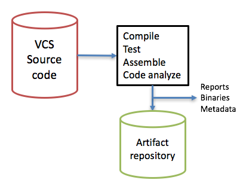
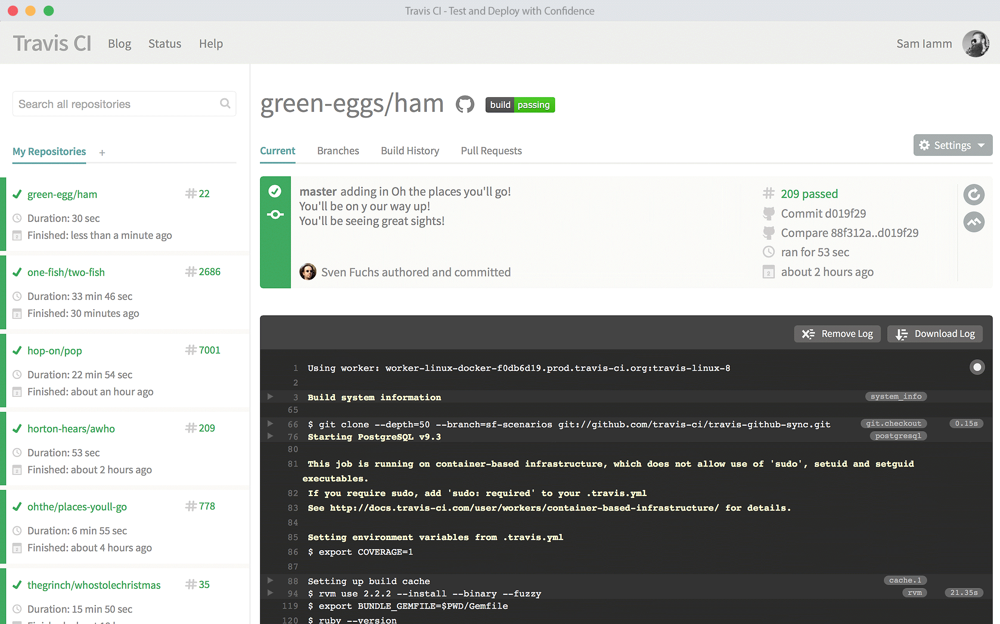
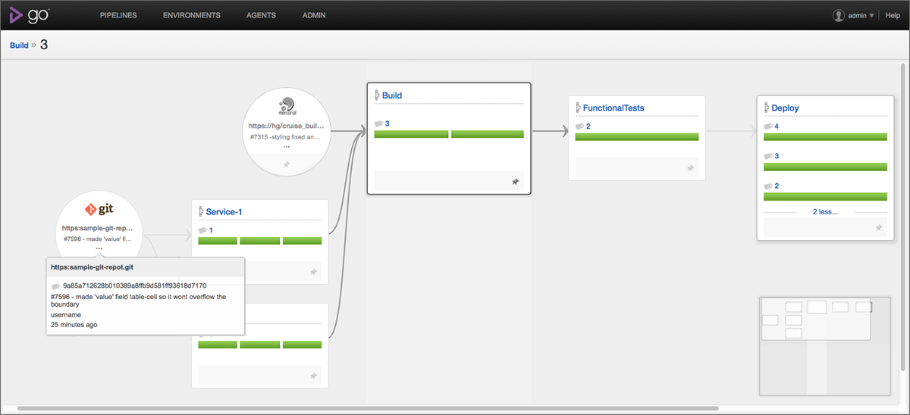
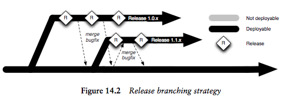
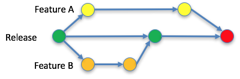
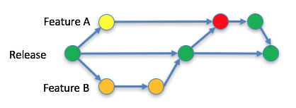

## Content

* Continuous Integration
  * Definition (again)
  * Commit Stage
  * CI servers
    * Some kind of demo...
* Branching vs Continuous Integration
  * Patterns
  * Merging, rebasing
  * Is branching bad?


---
## Continuous Integration
* Regular integration of code base
  * Avoid integration debts
* 1999ish, Kent Beck, "extreme programming explained"
  * The phrase has been used earlier
* Keep the software at working state all the time
  * Without CI - Software is broken until proven it works
  * With CI - Software works until it broken
* Key concepts
  * Single source repository
  * Automated builds (CI -server)
  * Self-testing
  * Agreement of the team


--
## Best practices

* Check in regularly
  * A couple of times per day
    * Every developer!
  * This means smaller changes
    * Less chance of breaking the build
    * Refactor discipline, preserve behavior of the software
    * Regular breaks from code mode, avoid tunnel vision
  * Fix broken build fast
    * Don´t check in on a broken build
    * Have a plan, confidence in fixing broken builds
  * Be prepared to revert
    * Can´t fix the problem in 10 minutes - revert
    * Don´t comment out the tests


--
## Best practices
* The one that check in must monitor the build process
  * Should not start new work until build is OK
    * No lunch, Don´t go home...
* Everyone should see the latest build
  * No blame game...
* Run tests both at the developer and in the CI server
  * Update from VCS, easy to get the latest version
  * Run tests and build, keep it fast
  * Commit - Push
* Test in production environment
  * Automate the deployment?


---
## Start with the commit stage
* The entrance to the deployment pipeline (on success)
  * Early testing => Fast feedback
    * Even in the IDE (unit test, lint, syntax, style checking, code quality)
    * Tools (CI servers) that makes pretested commits
  * What should break the build?
    * Code coverage? Warnings? Numbers of ToDos?
  * Have a Build master?
    * Rotating role in big teams
    * When introducing the pipeline to a team

<div>

<!-- {_style="width: 25%"} -->
</div>
<!-- {_class="center"} -->


--
## About testing in the commit step
* Test pyramid
  * Avoid UI testing
  * Avoid hitting DB
  * Mocks and stubs
  * Use dependency injections
* Keep it fast, keep it short
  * If it take to long time people will ignore it
  * Risk of getting multiple commits in the pipeline

https://medium.com/@eliasnogueira/trust-your-pipeline-automatically-testing-an-end-to-end-java-application-4a33232180c3
<!-- {_style="font-size: 45%"} -->


---
## CI - software
* Long-running process
  * Execute workflows at regular intervals
  * Pull changes from VCS
    * Pulls on triggers (e.g. web hooks)
  * Jobs/Stages trigger other jobs/stages
    * Building, testing, running scripts 
    * Building pipelines
* A view of the build and test result
  * Everyone should see the status
    * Test coverage, performance, analyses
    * Green/red - integration with physical things?
* Artifact repository often included (some kind of)
  * There are commercial systems
    * like JFrogs "Artifactory"
    * Version control, tagging, pinning and so on


--
## CI servers

* Jenkins
  * Open source, JAVA, Mature, Most popular?
    * Forked from Hudson 2011 (Oracle claimed the name)
  * Flexible with lots and lots of plugin 
  * Web UI 
    * REST API, Jenkinsfile (groovy)

<div>

<!-- {_style="width: 40%"} -->
</div>
<!-- {_class="center"} -->


--
## CI servers

* Travis CI
  * SAAS, https://travis-ci.org/
  * Build and test projects on GitHub
    * Try it through "GitHub education pack"
    * Free for open source projects
  * travis.yml - root at the repository
<div>  

<!-- {_style="width: 60%"} -->
</div>
<!-- {_class="center"} -->


--
## CI servers

* Go CD
  * ThoughtWorks company
  * Free of charge, support costs
  * Include the concepts of more complex pipelines




--
## CI servers

* Others
  * TeamCity
    * JetBrain, Mature, enterprise, best .NET support
  * Bamboo
    * Atlassian, JIRA and Bitbucket, Also as cloud service
  * CircleCI
    * Cloud service, GitHub, Docker support, Fast and cheap
  * CodeShip
    * Cloud service, Pro versions have Docker support

<p>
Source: https://www.code-maze.com/top-8-continuous-integration-tools/
</p>
<!-- {_style="font-size: 70%"} -->


--
## Some kind of demo

> Showing a dummy node.js application on Jenkins with code coverage, lint, style check (standard.js) and some testing


---
## How to work in your pipeline?

> Always releasable - How?

* Start from scratch
  * No releasable artifacts?
  * Be pragmatic
    * But use the pipeline and workflows as fast as you can
* How to implement features that take a while to develop
  * Pure CI?
    * Use feature hiding/toggle/branch by abstraction
  * But my VCS do have branches...
    * Many people work with the code base - avoid disturbing work
      * Non releasable code in branches?
      * Is branches bad?
   


--
## How to work with your VCS
* Not only version control, also how to work in a team
  * Many team members
  * Coordinate and optimize code updates
* Branching
  * Make a branch to keep work isolated
  * Lots of different branch patterns
  * **Never have long-lived branches**
* Merging
  * Bringing branches together, applying the changes
  * Risk of merge conflicts - time consuming
    * What is the right code to merge in a conflict?
    * Semantic conflicts - Rename the class while adding class references
    * More branches smaller changes?
    * Merge often!


--
## Branching patterns/workflows

* Develop on mainline/master
* Release branches
* Story/Feature branches
  * `git checkout -b newFeature master`
* Team branches


<!-- {_style="width: 35%"} -->


--
# Develop on master
* All check/push code into master
* This ensure CI, changes handled directly
* Avoid merge- and integration hell
* Rarely use branches
  * Release branches
  * Spikes
    * Test how much work to solve or work around a issue
    * Letting people getting familiar with new tools...
  * Never merge back to master
    * Bug fixes in master


--
## Release branches
* Acceptable to create branch short before a release
  * Only add critical bug fixes
  * Merge these directly to master
* New development and features always goes into master
  * Dev can start work direct after release branch
* Tag the branch on release
* Could be tricky in large teams
  * Modularity in the code helps 
  * API interfaces between components
* If you do once-a-week releases it may be cheaper with check into master


--

<!-- {_style="width: 70%"} -->

Image from: Continuous Delivery, Humble and Farley
<!-- {_style="font-size: 40%"} -->


--
## Story/Feature branches
* Every story or feature will be a branch
  * After completion and testing - merge into master 
  * Keeps the master clean - Check-ins won´t interfere 
* **Branches must be short lived!** 
* Limit the number of open branches!
* Could use "pull requests"


  
<!-- {_style="width: 40%"} -->


--
## Team branches
* Try solving the problem with big teams
  * Create small teams with own branch
    * Merge from master daily
  * When story is done, stabilize the branch, merge to master
    * Run all kind of tests
    * Make release


--
## Is branching against CI?
* No, not if handle right
* Release branching is fine
* Feature branching could be antithetical to CI!
  * Could easy become an anti-pattern





--
## Solutions?

* Use CI servers
* No long-lived branches! No long-lived branches!
  * NO LONG-LIVED BRANCHES!
* Size of the group?
  * Feature branching will work if carefully
  * Start with checking into master or release branching
* Always do real testing on you branches before merging (into master branch)
* Rebase from master branch before running tests to catch changes
  * Could pollute the branch if active master branch
* Find your solution, the release process should be seamless
  * Bring the pain forward...


--
## More
* Git workflow
 * https://www.atlassian.com/git/tutorials/comparing-workflows/gitflow-workflow
* Forking workflows
  * https://www.atlassian.com/git/tutorials/comparing-workflows/forking-workflow


--
## Git commands you need to know

```
git checkout 
git merge
git rebase
git reflog
git reset
git log
git revert
```


<!-- {_style="font-size: 40%"} -->


---
## Reading

> Chapter 3, 5, 7 and 14 (skip Distribution version control systems) in the Continuous Delivery book by Humble and Farley
