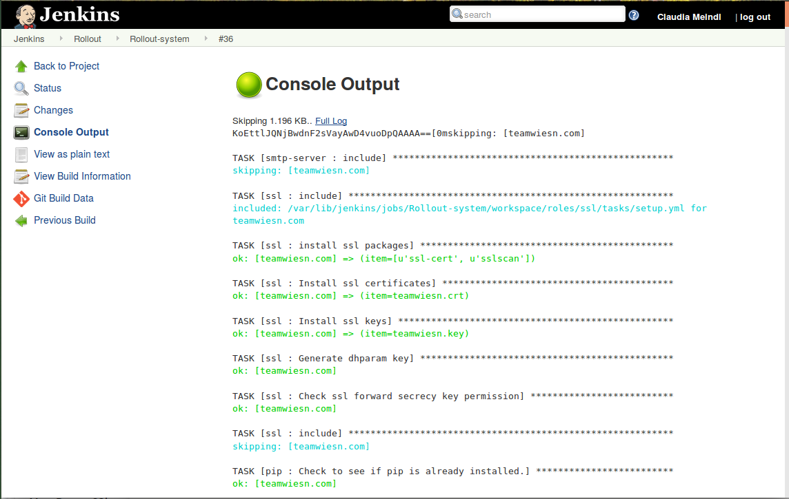

## Content

* Continuous Integration
  * Definition (again)
  * CI servers
    * Demo
* Branching vs CI
  * Patterns
  * Merging, rebasing


---
## Definitions of CI

* Keep the software at working state all the time
* Regular integration of code base
* 1999, Kent Beck, "extreme programming explained"
* Without CI
  * Software is broken until proven it works
* With CI
  * Software works until it broken
* VCS, Automated builds (CI -server), Agreement of the team


--
## Practices

* Check in regularly
  * A couple of times per day
  * This means smaller changes
    * Less chance of breaking the build
    * Refactor discipline, preserve behavior of the software
    * regular breaks from coding, avoid tunnel vision
  * Fix broken build fast
  * Working with feature branches?
    * Branches != CI?
    * Long-lived branches will have integration problems


--
## Practices
* Don´t check in on a broken build
  * Priority to fix broken build
* Run tests both at the developer and in the CI server
  * Update from CSV
  * Run tests and build
  * Commit - Push
* The one that check in must monitor the build process
  * Should not start new work until build is OK
  * No lunch, Don´t go home
* Be prepared to revert
  * Can´t fix the problem in 10 minutes - revert
  * Don´t comment out the tests


---
## The commit stage
* The entrance to the deployment pipeline (on success)
  * Fast feedback
    * Even in the IDE
    * Tools (CI servers) that makes pretested commits
  * What should break the build?
    * code coverage? Warnings? Numbers of ToDos
  * Have a Build master?
    * Rotating role in big teams
    * When introducing the pipeline

<div>

<!-- {_style="width: 25%"} -->
</div>
<!-- {_class="center"} -->


--
## About testing in the commit step
* Test pyramid
  * Avoid UI testing
  * Avoid hitting DB
  * Mocks and stubs
  * Use dependency injections
* Keep it fast, keep it short
  * If it take to long time people will ignore it
  * Risk of getting multiple commits in the pipeline


---
## CI - software
* Long-running process
  * Execute workflows at regular intervals
  * Polls the CSV
  * Pulls on triggers, jobs trigger other jobs 
    * Building pipelines
* A view of the build and test result
  * Everyone should see the status
    * test coverage, performance, analyses
    * green/red - integration with physical things
* Artifact repository?
  * There are commercial systems
    * like JFrogs "Artifactory"
    * Version control, tagging, pinning and so on


--
## CI servers

* Jenkins
  * Open source, JAVA, 
  * Flexible with lots and lots of plugin 
  * Web UI 
  * Forked from Hudson 2011 (Oracle claimed the name)

<div>

<!-- {_style="width: 45%"} -->
</div>
<!-- {_class="center"} -->


--
## CI servers

* Travis CI
  * SAAS, https://travis-ci.org/travis
  * Build and test projects on GitHub
  * travis.yml - root at the repository
  * Free for open source projects
  


--
## CI servers

* Go CD
  * ThoughtWorks company
  * Free of charge, support costs
  * Include the concepts of more complex pipelines


--
## CI servers

* Others
  * TeamCity
    * JetBrain, Mature, enterprise, best .NET support
  * Bamboo
    * Atlassian, JIRA and Bitbucket, Also as cloud service
  * CircleCI
    * Cloud service, GitHub, Docker support, Fast and cheap
  * CodeShip
    * Cloud service, Pro versions have Docker support

<p>
Source: https://www.code-maze.com/top-8-continuous-integration-tools/
</p>
<!-- {_style="font-size: 70%"} -->


--
## Short demo

> Setting up a node.js "Hello world" on Jenkins


---
## How to work in your pipeline?

> Always releasable - How?

* Start of project
  * No releasable code?
* How to implement features that take a while to develop
  * Pure CI?
    * Use feature hiding/toggle/branch by abstraction
  * But VCS have branches?
    * Pure CI/lean call this waste
    * Many people work with the code base - avoid disturbing work


--
## How to work with your VCS
* Not only version control, also how to work in a team
  * Many team members
  * Coordinate and optimize code updates
* Branching
  * Make a branch to keep work isolated
  * Lots of different branch patterns
  * **Never have long-lived branches**
* Merging(Rebasing)
  * Bringing branches together, applying the changes
  * Risk of merge conflicts - time consuming
    * What is the right code to merge?
    * Semantic conflicts - Rename the class while adding class references
    * More branches smaller changes
    * Merge often!


--
## Branching (or not)

* Develop on mainline/master
* Story/Feature branches
  * `git checkout -b newFeature master`
* Release branches
* Team branches
* Merging conflicts and broken builds


--
# Develop on master
* All check/push code into master
* This ensure CI, changes handled directly
* Avoid merge- and integration hell
* Rarely use branches
  * Release branches
  * Spikes
    * Test how much work to solve or work around a issue
    * Letting people getting familiar with new tools...
  * Never merge back


--
## Branch for release
* Acceptable to create branch short before a release
  * Only add critical bug fixes
  * Merge directly to master
* New development and features always goes into master
  * Dev can start work direct after release branch
* Tag the branch on release
* Could be hard in large teams
  * Modularity in the code helps
  * API interfaces
* If you do once-a-week releases it may be cheaper with check into master


--

<!-- {_style="width: 70%"} -->

Image from: Continuous Delivery, Humble and Farley
<!-- {_style="font-size: 40%"} -->


--
## Branch by feature/story
* Every story or feature will be a branch
  * After completion and testing - merge into master 
  * Keeps the master clean - Check-ins won´t interfere 
* **Branches must be short lived!** 
* Limit the number of open branches
* Using "pull requests"


  
<!-- {_style="width: 40%"} -->


--
## Is branching against CI?
* No, not if handle right
* Release branching is fine
* Feature branching could be antithetical to CI!
  * Could easy become an anti-pattern


--
## Solutions?

* Be pragmatic!
  * Use CI servers
* No long-lived branches! No long-lived branches!
  * No long-lived branches!
* Size of the group?
  * Feature branching will work if carefully
  * Start with checking into master or release branching
* Always do real testing on you branches before merging (into master branch)
* Rebase from dependent branches (master branch)
  * Could pollute feature branch if active master branch
* Find your solution, the release process should be seamless


--
## More
* Git workflow
 * https://www.atlassian.com/git/tutorials/comparing-workflows/gitflow-workflow
* Forking workflows
  * https://www.atlassian.com/git/tutorials/comparing-workflows/forking-workflow

  
--
## Merge vs. Rebase
* Merge
  * Having a developing on a feature branch. When you want to bring those changes back to master. You **merge** this change into master
* Rebase
  * When pulling changes from master onto your feature branch/local development. Then use **rebase**


--
## Git commands you need to know

```
git checkout 
git merge
git rebase
git reflog
git reset
git log
git revert
```

https://git-scm.com/book/en/v2/Git-Branching-Basic-Branching-and-Merging
<!-- {_style="font-size: 40%"} -->


---
## Reading

> Chapter 3, 5, 7 and 14 (skip Distribution version control systems) in the Continuous Delivery book by Humble and Farley
