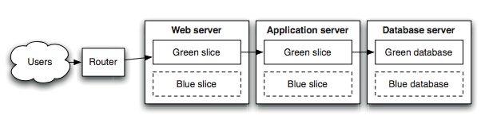
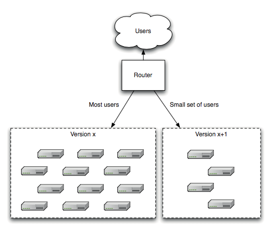

## Content
Deploying and Releasing Applications
* Release Strategy
* Staging Environments
* Going to production
* Zero-Downtime Releases
  * Blue-green deployments
  * Canary Releasing
* Tips and Tricks

---
## Deploying and Releasing Applications
* Release Strategy
  - who is in charge of deployments to each environment
  - asset and configuration management strategy
  - which technology should be used for deployment
  - plan for implementing the deployment pipeline
  - which test environments should be available for:
    - acceptance
    - capacity
    - integration
    - user acceptance
  - requirements for monitoring the application

Note:
Meeting with all stackholders to discus deployment and maintenance of the application throughout its lifecycle

--
## Deploying and Releasing Applications
* Release Strategy
  - description of the integration with any external systems
    - at what stage and how are they tested
    - communication with the provider in the event of a problem
  - disaster recovery plan
  - service-level agreements for the software
    - failover and other high-availability strategies
  - production sizing and capacity planning
  - archiving strategy
  - initial deployment to production
  - how fixing defects and applying patches to the production environment
  - how upgrades to the production environment will be handled

Note:
**Production sizing and capacity planning** 
How much data will your live application create? 
How many log files or databases will you need? 
How much bandwidth and disk space will you need? 
What latency are clients expecting? 

--
## The Release Plan
A document that describes how to:
* release the application for the first time
* smoke-test the application
* back out if something go wrong during the deployment
* back up and restore the application’s state
* update the application without destroying the application’s state
* rollback if somethings go wrong
* monitoring the application
* log problems from previous deployments, and their solutions

--
## The first deployment
> “The first deployment of any application should happen in the first iteration when you showcase your first stories or requirements to the customer.”<!-- {_style="font-size: 75%"} -->

After this first iteration, you should have the following in place:
* Your deployment pipeline’s commit stage
* A production-like environment to deploy to
* An automated process that takes the binaries created by your commit stage and deploys them into the environment
* A simple smoke test that verifies that the deployment worked

Note: 
“How different is the production environment from my development environment?”

---
## Staging Environments
Last step before going to production
* close replica of production environment 
* automated process for configuring your environment, including:
  - networks
  - external services
  - infrastructure
* Ensure the deployment process is adequately smoke-tested
* Measure the warm-up period for your application
* Test integration with external systems
* Deploy every change that passes acceptance tests to your staging environment (although not necessarily to production).

---
## Going to production
* deploying to production can lead to down time
* when should we run the deploy

Steps for deploying to production:
* if everything works out in our staging environment  we can move on to production
* take a backup of the production environment before  deploying the new version
* smoke test
* if something goes wrong you can redeploy the old  version and restore the backup

--
## Rolling Back Deployments
If something goes wrong you need to be able to roll back to a working version
<!-- {_style="font-size: 80%"} -->
* can be challenging
  - if release change data
  - if release involve more than one system
* create a plan for rolling back a release
  - backup the state of your production system
  - practice your rollback plan
* methods of performing a rollback
  - redeploying the previous good version
    - +simplest way to roll back
    - -lead to downtime
    - -hard to debug what went wrong
    - -restoring DB can lead to data lose
  - blue-green deployments
  - canary releasing

<!-- {_style="font-size: 70%"} -->

---
## Zero-Downtime Releases
* also known as hot deployment
* switching users from one release to another happens nearly instantaneously
* can be problematic and hard to implement
  - how to handle shared resources like, database, services, static resources
* Blue-green deployments
* Canary Releasing

--
## Blue-green deployments
  
Steps for a Blue-green deployments
1. Users are routed to the green environment
2. Deploy new version to the blue environment
3. Warm up the application
4. Smoke tests blue environment
5. Changing the router configuration to point to the blue environment
6. Blue environment becomes production

<!-- {_style="font-size: 65%"} -->
Nothing in step 2-4 should affect the operation of the green environment
<!-- {_style="font-size: 75%"} -->

--
## Blue-green deployments
Pros
* zero-downtime release
* easy to switch back to working version
* debug

Cons
* cost
 - you can use staging as blue
* how to handle database
  - read-only before switchover, copy green to blue
  - migrate the database independently of the upgrade process

--
## Canary Releasing
> Canary release is a technique to reduce the risk of introducing a new software version in production by slowly rolling out the change to a small subset of users before rolling it out to the entire infrastructure and making it available to everybody. 
 -Danilo Sato<!-- {_style="taxt-align: right"} -->
<!-- {_style="font-size: 65%"} -->

Canary releasing aims to address the following challenges:
* testing in production
* faster feedback on the new features
* capacity testing in large production environment

--
## Canary Releasing
 
<!-- {_style="float:right; width:400px"} -->
Steps for a canary releasing
1. Like blue-green, you deploy the new version to a set of servers  where no users are routed to
2. Warm up, smoke tests, capacity tests
3. Start to route selected users to the new version
4. If everything works well
5. Move more server and users to the new version

<!-- {_style="font-size: 65%"} -->

--
## Canary Releasing
Pros
* capacity testing
* monitor and capture metrics about the new version
* safe rollback 

Cons
* multiple versions of your software at once
* hard when you have distribute software
* managing database changes

--
## Canary Releasing
Some notes about A/B testing and canary releasing
* canary releases can be used as a way to implement A/B testing
* however, it is preferable to avoid conflating these two concerns
  - canary releases are a way to detect problems
  - A/B testing is a way to test/measure a feature
* A/B testing can take days
* canary rollout should complete in minutes or hours.

---
## Tips and Tricks

* Log deployment activities
* Don’t delete the old files, move them
* Deployment is the whole team’s responsibility
* Server applications should not have GUIs
* Have a warm-pp period for a new deployment
* Fail fast
* Don’t make changes directly on the production environment

---
## Reading

> Chapter 10 and 12 in the Continuous Delivery book by Humble and Farley
